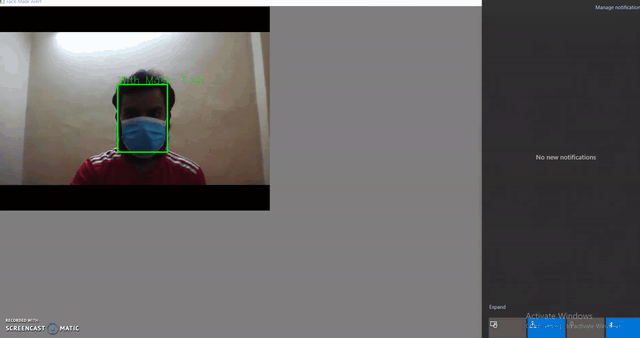

# Face-Mask-Detection-Alert-Service
[](LICENSE)

This repo will helps to detect the person is wearing face mask or not and sending desktop notification if the person is without mask.

### Framework and Library used

 -[x] PyTorch
- [x] Opencv
- [x] Numpy
- [x] Pillow
- [x] Win10toast

### How to run

For image：
```
python inference.py  --img-path /path/to/your/img
```
For webcam:
```
python inference.py --img-mode 0 --video-path 0
```
For input video:
```
python inference.py --img-mode 0 --video-path /path/to/video  
```


### Demo



### Credit

https://github.com/AIZOOTech/FaceMaskDetection
